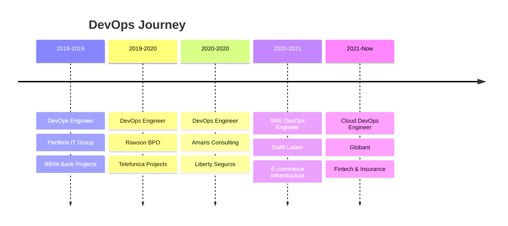

<!--
**WillRaido/WillRaido** is a ✨ _special_ ✨ repository because its `README.md` (this file) appears on your GitHub profile.

Here are some ideas to get you started:

- 🔭 I’m currently working on ...
- 🌱 I’m currently learning ...
- 👯 I’m looking to collaborate on ...
- 🤔 I’m looking for help with ...
- 💬 Ask me about ...
- 📫 How to reach me: ...
- 😄 Pronouns: ...
- ⚡ Fun fact: ...
-->
# Hi there! 👋 I'm William Quintero Torres

  

  

---

## 🚀 About Me

> **Seasoned DevOps & Cloud Engineer** with 7+ years in DevOps practices and 12+ years in diverse IT roles

- 🌩️ **Cloud Architect** specializing in AWS, Azure, GCP
- 🔧 **DevOps Enthusiast** passionate about automation and CI/CD
- 🛡️ **Security-minded** with focus on DevSecOps practices  
- 🌍 **Based in:** Bogotá, Colombia
- 🎯 **Current Role:** Cloud DevOps Engineer @ Globant
- 📚 **Always Learning:** Kubernetes, Terraform, and Cloud Security

---

## 🛠️ Tech Stack & Tools

<table align="center">
<tr>
<td valign="top" width="33%">

### ☁️ Cloud Platforms

### 🏗️ Infrastructure as Code

</td>
<td valign="top" width="33%">

### 🔄 CI/CD & DevOps

### 🐳 Containerization & Orchestration

</td>
<td valign="top" width="33%">

### 📊 Monitoring & Observability

### 💻 Programming & Scripting

</td>
</tr>
</table>

---

## 📈 GitHub Stats

<table>
<tr>
<td align="center" width="50%">

</td>
<td align="center" width="50%">

</td>
</tr>
<tr>
<td colspan="2" align="center">

</td>
</tr>
</table>

---

## 🏆 Certifications & Achievements

### 🐙 GitHub Certifications

<table>
<tr>
<td align="center" width="20%">

 <strong>GitHub Foundations</strong>
 🏅 Nov 2024
</td>
<td align="center" width="20%">

 <strong>GitHub Actions</strong>
 🏅 Dec 2024
</td>
<td align="center" width="20%">

 <strong>GitHub Advanced Security</strong>
 🏅 Nov 2024
</td>
<td align="center" width="20%">

 <strong>GitHub Copilot</strong>
 🏅 2024
</td>
<td align="center" width="20%">

 <strong>GitHub Admin</strong>
 🏅 2024
</td>
</tr>
</table>

### ☁️ Cloud & Other Certifications
<table>
<tr>
<td align="center" width="25%">

 <strong>AWS Certified SysOps</strong>
 <strong>Administrator Associate</strong>
 ☁️ 2024
</td>
<td align="center" width="25%">

 <strong>Systems Engineer</strong>
 University U Compensar
 🎓 2023
</td>
<td align="center" width="25%">

 <strong>Advanced English</strong>
 Academy Australia
 🗣️ 2023
</td>
<td align="center" width="25%">

 <strong>Engineering of</strong>
 <strong>Requirements</strong>
 ASESOFTWARE SAS
 📋 2015
</td>
</tr>
</table>

---

## 💼 Professional Experience

---

## 🔥 What I Do

<table align="center">
<tr>
<td valign="top" width="50%">

### 🎯 **Core Expertise**
- **☁️ Cloud Architecture** - Design and implement scalable cloud solutions across AWS, Azure, and GCP
- **🔄 CI/CD Pipelines** - Build robust automation pipelines for continuous integration and delivery
- **🏗️ Infrastructure as Code** - Manage infrastructure using Terraform, CloudFormation, and Ansible

</td>
<td valign="top" width="50%">

### 📋 **Specialized Skills**
- **🐳 Containerization** - Docker and Kubernetes orchestration for microservices architectures
- **📊 Monitoring & Observability** - Comprehensive monitoring with Datadog, Grafana, and more
- **🛡️ Security & Compliance** - DevSecOps practices ensuring security throughout SDLC

</td>
</tr>
</table>

---

## 🌟 Recent Projects & Contributions

  
  

---

## 🎨 Interests & Hobbies

🎵 **Music** | ✈️ **Travel** | 📚 **Learning** | 👨‍🍳 **Cooking** | 💪 **Exercise** | 🔬 **Science** | 🎬 **Movies**

---

## 📊 Activity Graph

  

---

## 🎯 Current Goals

- 🚀 **Mastering** advanced Kubernetes security patterns
- 📱 **Exploring** serverless architectures and FaaS platforms  
- 🤖 **Learning** AI/ML operations (MLOps) integration
- 🌐 **Contributing** to open-source DevOps tools
- 📈 **Growing** expertise in multi-cloud strategies

---

### 💬 Let's Connect!

*"Building innovative, responsible, and efficient cloud solutions"*

**⭐ From [WillRaido](https://github.com/WillRaido) - Always learning, always building!**

